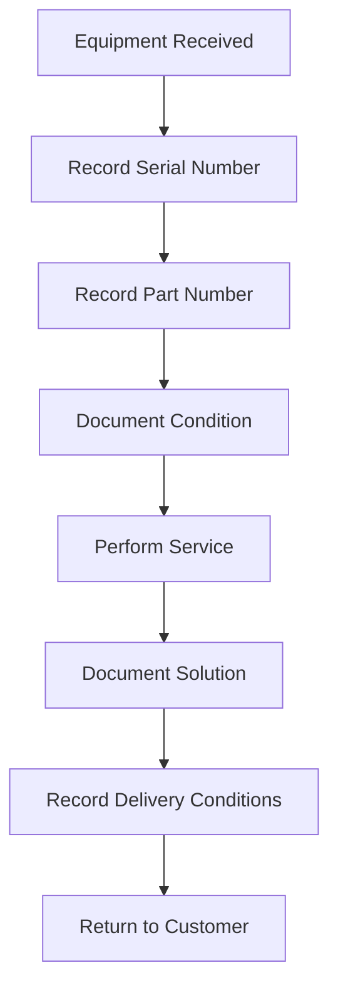

## Overview

Equipment Management is a critical component of the service order system, enabling precise tracking of equipment through part numbers, serial numbers, equipment types, and delivery conditions. This ensures accurate service history and warranty management.

## Equipment Data Structure

Equipment information is embedded within each service order:

```typescript types/ServiceOrder.ts
export interface ServiceOrder {
    id: number,
    number: number,
    type: string,
    part_number: string,           // Equipment part identification
    serial_number: string,         // Unique equipment serial
    description: string,           // Equipment condition/issues
    solution: string,              // Service performed
    // ... other fields
    delivery_conditions: DeliveryConditions
}
```

## Equipment Type Interface

Equipment types categorize the kind of equipment being serviced:

```typescript types/ServiceOrder.ts
export interface EquipmentType {
    name: string
}
```

### Common Equipment Types

The system tracks various equipment brands and types:

<CardGroup cols={3}>
  <Card title="Lenovo" icon="laptop">
    Laptops and desktops
  </Card>
  
  <Card title="HP" icon="laptop">
    PCs and peripherals
  </Card>
  
  <Card title="Dell" icon="laptop">
    Business equipment
  </Card>
</CardGroup>

Example from the system:

```typescript composables/useServiceOrders.ts
{
  id: 1,
  equipment_types: { name: "Lenovo" },
  part_number: "ab123",
  serial_number: "6303934"
}
```

## Part Numbers

Part numbers identify the specific model or SKU of equipment:

<ResponseField name="part_number" type="string" required>
  Alphanumeric identifier for the equipment model (e.g., "ab123", "cd456", "ef789")
</ResponseField>

### Part Number Usage

- **Warranty Verification**: Confirms equipment is under warranty
- **Parts Ordering**: Ensures correct replacement parts are ordered
- **Service Documentation**: Creates accurate service records
- **Inventory Management**: Tracks which equipment models require service most frequently

```typescript composables/useServiceOrders.ts
{
  type: "garantía",
  part_number: "ab123",
  description: "Lorem ipsum dolor sit amet..."
}
```

## Serial Numbers

Serial numbers uniquely identify individual equipment units:

<ResponseField name="serial_number" type="string" required>
  Unique identifier for the specific equipment unit (e.g., "6303934", "7304945", "8305956")
</ResponseField>

### Serial Number Importance

<AccordionGroup>
  <Accordion title="Warranty Tracking">
    Serial numbers are essential for warranty claims, as manufacturers track warranty coverage by serial number.
  </Accordion>
  
  <Accordion title="Service History">
    Each serial number has a unique service history, helping identify recurring issues with specific units.
  </Accordion>
  
  <Accordion title="Asset Management">
    Companies track their equipment inventory using serial numbers for asset management.
  </Accordion>
  
  <Accordion title="Theft Prevention">
    Serial numbers help identify and recover stolen equipment.
  </Accordion>
</AccordionGroup>

## Equipment Information in Order Form

When creating a service order, equipment details are captured:

```vue pages/serviceorders/order.vue
<div class="mb-3 col-2">
    <label for="company" class="font form-label fw-bold">N° parte:</label>
    <div class="input-group" style="height: 7px;">
        <select id="company" class="form-select">
        </select>
    </div>
</div>
<div class="col-4 mb-3">
    <label for="contact" class="font form-label fw-bold">Nombre equipo:</label>
    <div class="input-group" style="height: 7px;">
        <select id="company" class="form-select">
        </select>
    </div>
</div>
<div class="col-2 mb-3">
    <label for="serialNumber" class="font form-label fw-bold">Número de serie:</label>
    <div class="input-group" style="height: 7px;">
        <select id="company" class="form-select">
        </select>
    </div>
</div>
```

<Note>
The form uses dropdowns for part numbers and serial numbers to ensure data consistency and allow quick selection of previously serviced equipment.
</Note>

## Equipment Description

The description field captures the equipment's condition when received:

```vue pages/serviceorders/order.vue
<div class="col-9 mb-3">
    <label for="floatingTextarea" class="font form-label fw-bold">Descripción:</label>
    <textarea class="form-control"
        placeholder="Ingrese aqui la descripción del estado en el que se recibe el equipo"
        rows="5" id="floatingTextarea" v-model="selectedOrder.description"></textarea>
</div>
```

### What to Include in Descriptions

<Steps>
  <Step title="Physical Condition">
    Note any scratches, dents, cracks, or physical damage observed on receipt.
  </Step>
  
  <Step title="Operational Issues">
    Describe the reported problems (e.g., "pantalla rota" - broken screen, "no enciende" - won't power on).
  </Step>
  
  <Step title="Included Accessories">
    List accessories received with the equipment (charger, cables, bag, etc.).
  </Step>
  
  <Step title="Customer Concerns">
    Document specific concerns or requests from the customer.
  </Step>
</Steps>

Example descriptions from the system:

```typescript composables/useServiceOrders.ts
// Example 1: Detailed description
{
  description: "Lorem ipsum dolor sit amet consectetur adipisicing elit. Qui expedita temporibus ipsum, incidunt hic doloremque a voluptas magnam perferendis architecto harum, obcaecati adipisci ea recusandae. Veniam eveniet a quidem sequi?"
}

// Example 2: Specific issue
{
  description: "pantalla rota",
  solution: "cambio de pantalla"
}

// Example 3: Maintenance service
{
  description: "mantenimiento general",
  solution: "limpieza interna"
}
```

## Delivery Conditions

Delivery conditions document recommendations and the state of equipment upon delivery:

```typescript types/ServiceOrder.ts
export interface DeliveryConditions {
    description: string
}
```

### Delivery Conditions in Order View

```vue pages/serviceorders/order.vue
<div class="col-9 mb-3">
    <label for="solution" class="font form-label fw-bold">Recomendaciones:</label>
    <textarea class="form-control" rows="5" id="solution"
        v-model="selectedOrder.delivery_conditions.description"></textarea>
</div>
```

### Typical Delivery Condition Notes

<CodeGroup>
```text Accessories
con funda protectora
(with protective case)
```

```text Missing Items
sin cargador
(without charger)
```

```text Recommendations
Mantener en ambiente seco, evitar exposición directa al sol
(Keep in dry environment, avoid direct sunlight)
```
</CodeGroup>

Examples from the system:

```typescript composables/useServiceOrders.ts
{
  delivery_conditions: { description: "descripcion" }
},
{
  delivery_conditions: { description: "con funda protectora" }
},
{
  delivery_conditions: { description: "sin cargador" }
}
```

## Equipment in Detail View

The service order detail view displays all equipment information:

```vue pages/serviceorders/detail.vue
<div class="card-body col-6 shadow shadow-lg m-2 p-3">
    <a href="#" class="text-decoration-none text-dark fw-bold fs-4">
        
        <span style="color: #666168;">Información del Servicio</span>
    </a>
    <ul>
        <li class="mb-2 mt-4"><strong style="color: #5d5d5d;">Tipo servicio: </strong>{{ order.type }}</li>
        <li class="mb-2"><strong style="color: #5d5d5d;">Nombre del equipo: </strong>{{ order?.equipment_types?.name }}</li>
        <li class="mb-2"><strong style="color: #5d5d5d;">Número de parte: </strong>{{ order.part_number }}</li>
        <li class="mb-2"><strong style="color: #5d5d5d;">Numero de serie: </strong>{{ order.serial_number }}</li>
        <li class="mb-2"><strong style="color: #5d5d5d;">Descripción: </strong>{{ order.description }}</li>
        <li class="mb-2"><strong style="color: #5d5d5d;">Solución: </strong>{{ order.solution }}</li>
        <li class="mb-2"><strong style="color: #5d5d5d;">Condiciones de entrega: </strong>{{ order?.delivery_conditions?.description }}</li>
    </ul>
</div>
```

## Service Types and Equipment

The system supports three main service types:

<Tabs>
  <Tab title="Garantía (Warranty)">
    Equipment under manufacturer warranty. Requires valid part number and serial number verification.
    
    ```typescript
    {
      type: "garantía",
      part_number: "ab123",
      serial_number: "6303934"
    }
    ```
  </Tab>
  
  <Tab title="Reparación (Repair)">
    Out-of-warranty repairs or damage not covered by warranty.
    
    ```typescript
    {
      type: "reparación",
      part_number: "cd456",
      serial_number: "7304945",
      description: "pantalla rota",
      solution: "cambio de pantalla"
    }
    ```
  </Tab>
  
  <Tab title="Mantenimiento (Maintenance)">
    Preventive maintenance and cleaning services.
    
    ```typescript
    {
      type: "mantenimiento",
      part_number: "ef789",
      serial_number: "8305956",
      description: "mantenimiento general",
      solution: "limpieza interna"
    }
    ```
  </Tab>
</Tabs>

## Equipment Tracking Workflow



## Best Practices

<CardGroup cols={2}>
  <Card title="Verify Serial Numbers" icon="check-double">
    Always verify the serial number physically on the equipment matches what's entered in the system.
  </Card>
  
  <Card title="Photograph Equipment" icon="camera">
    Take photos of equipment condition on receipt for documentation and dispute resolution.
  </Card>
  
  <Card title="Complete Descriptions" icon="file-lines">
    Provide detailed descriptions including all visible issues and customer concerns.
  </Card>
  
  <Card title="Document Delivery" icon="truck">
    Clearly note delivery conditions, missing items, and recommendations for customer.
  </Card>
</CardGroup>

## Equipment Data Validation

<Warning>
The system should validate:
- Serial number uniqueness for warranty tracking
- Part number format consistency
- Required fields (serial number, part number) before order creation
- Equipment type selection from predefined list
</Warning>

<Tip>
Maintaining accurate equipment records enables:
- Faster warranty claim processing
- Better inventory management
- Identification of problematic equipment models
- Improved customer service through complete history
</Tip>
